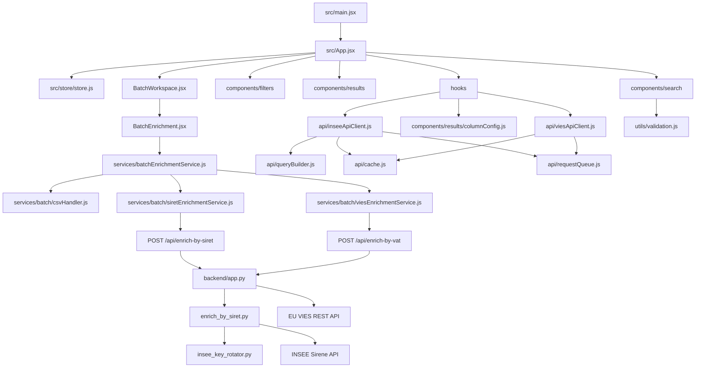
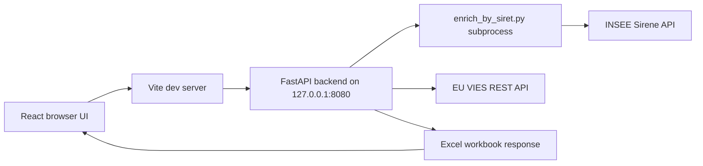
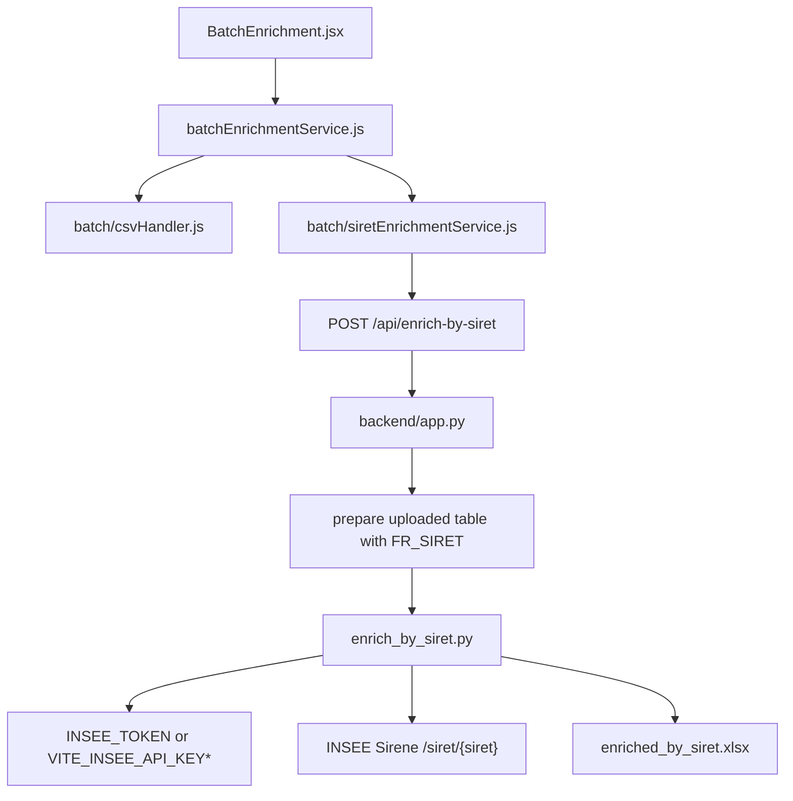
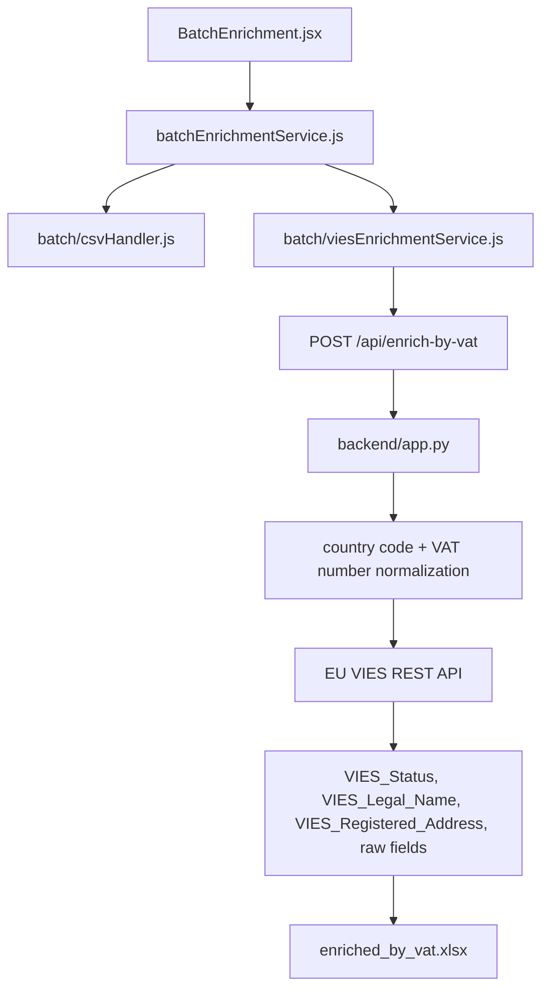
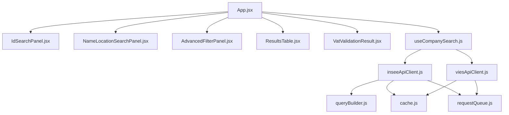

# Dependency Graph

Generated on 2026-05-07 with GitNexus plus local source inspection.

GitNexus source: [CodeWithJames-AI/gitnexus](https://github.com/CodeWithJames-AI/gitnexus).

Run notes:

- The current GitNexus README documents `npx gitnexus analyze` as the standard CLI indexing command.
- The published one-off package command still fails locally in this Windows workspace:

```powershell
npx gitnexus analyze . --force --skip-agents-md --skip-git
# Fails with: Cannot destructure property 'package' of 'node.target' as it is null.
```

- The already cloned GitNexus source was used successfully:

```powershell
node "$env:TEMP\gitnexus-CodeWithJames-AI\gitnexus\dist\cli\index.js" analyze . --force --skip-agents-md --skip-git
```

GitNexus index result:

| Metric | Count |
| --- | ---: |
| Files indexed | 87 |
| Symbols / nodes | 953 |
| Edges | 2,723 |
| Clusters / communities | 79 |
| Execution flows / processes | 79 |
| Embeddings | 0 |

## Current Layer Graph



## Runtime Boundary Graph



## High-Level Dependency Edges

| From | To | Role |
| --- | --- | --- |
| `src/App.jsx` | `components/search` | Search and verification tabs. |
| `src/App.jsx` | `components/filters` | Advanced INSEE filters and active chips. |
| `src/App.jsx` | `components/results` | Tables, VAT result cards, modals, pagination, export. |
| `src/App.jsx` | `components/batch` | File import and batch enrichment workspace. |
| `src/hooks/useCompanySearch.js` | `api/inseeApiClient.js` | Direct SIRET/SIREN/name search. |
| `src/hooks/useCompanySearch.js` | `api/viesApiClient.js` | Direct VAT verification. |
| `src/components/batch/BatchEnrichment.jsx` | `src/services/batchEnrichmentService.js` | Browser file preview and backend upload adapter. |
| `src/services/batchEnrichmentService.js` | `services/batch/csvHandler.js` | CSV/TSV/XLSX/XLSM preview parsing. |
| `src/services/batchEnrichmentService.js` | `services/batch/siretEnrichmentService.js` | SIRET column detection and `/api/enrich-by-siret` upload. |
| `src/services/batchEnrichmentService.js` | `services/batch/viesEnrichmentService.js` | VAT/country column detection and `/api/enrich-by-vat` upload. |
| `backend/app.py` | `enrich_by_siret.py` | Server-side SIRET enrichment subprocess. |
| `backend/app.py` | EU VIES API | Server-side VAT validation for uploaded files. |

## SIRET Batch Subgraph



## VAT Batch Subgraph



## Direct Search And Verification Subgraph



## Important Files

| Area | File | Responsibility |
| --- | --- | --- |
| App composition | `src/App.jsx` | Wires service choice, tabs, forms, batch workspace, and result views. |
| Search orchestration | `src/hooks/useCompanySearch.js` | Routes direct searches to INSEE or VIES clients. |
| INSEE API boundary | `src/api/inseeApiClient.js` | INSEE search/lookup requests and normalization. |
| VIES API boundary | `src/api/viesApiClient.js` | Direct VAT verification requests and normalization. |
| Batch UI | `src/components/batch/BatchEnrichment.jsx` | Upload, treatment selector, column mapping, pre-flight summary, backend submission, download. |
| Batch facade | `src/services/batchEnrichmentService.js` | Stable frontend import point for CSV preview and backend adapters. |
| SIRET backend adapter | `src/services/batch/siretEnrichmentService.js` | Detects SIRET column and posts files to FastAPI. |
| VAT backend adapter | `src/services/batch/viesEnrichmentService.js` | Detects VAT/country columns and posts files to FastAPI. |
| Backend API | `backend/app.py` | FastAPI endpoints, file validation, VIES enrichment, SIRET subprocess boundary. |
| SIRET engine | `enrich_by_siret.py` | INSEE Sirene batch lookup by SIRET and Excel output formatting. |
| INSEE key rotation | `insee_key_rotator.py` | Server-side integration-key throttling/rotation. |

## Dependency Notes

- The current batch flow is intentionally backend-centered for external enrichment. The browser previews files and chooses columns; FastAPI owns INSEE/VIES calls.
- `BatchVatValidatorPanel.jsx` and `vatValidationService.js` are no longer part of the live graph. VAT batch processing now goes through `BatchEnrichment.jsx` and `backend/app.py`.
- `InstitutionLogos.jsx` is no longer part of the live graph. The service selector now uses neutral text labels.
- The older multi-step enrichment pipeline files still exist under `src/services/batch`, `src/domain`, and related service folders. They are not on the current simplified batch upload path, but several tests still cover them. Treat them as legacy candidates for a separate dead-code removal pass.
- `exceljs` is the largest frontend runtime dependency because browser-side spreadsheet preview/export support remains available.
