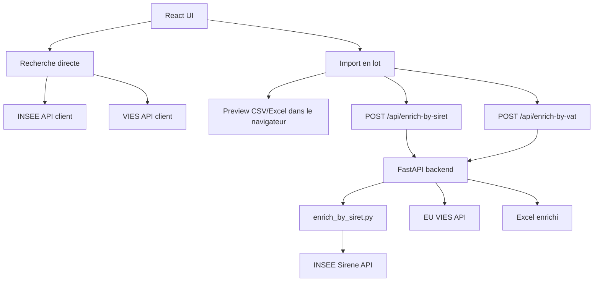

# INSEE UI APP

> English below.

Application React + Vite avec une frontiere backend FastAPI Python pour rechercher des entreprises, verifier des numeros TVA et enrichir des fichiers CSV/Excel cote serveur.

## Contact rapide

Pour toute question, suggestion, collaboration ou demande d'aide:

**Mouad Ibnelaryf** - [ibnelaryf.mouad@gmail.com](mailto:ibnelaryf.mouad@gmail.com)

## Fonctionnalites

- Recherche interactive INSEE par nom d'entreprise, SIRET ou SIREN.
- Verification interactive TVA/VIES avec nom legal, numero TVA, adresse enregistree, statut et date de requete.
- Import en lot depuis CSV, TSV, XLSX ou XLSM.
- Choix du traitement sur le cote: `SIRET INSEE` ou `TVA / VAT Verification`.
- Selection de la colonne SIRET ou TVA apres lecture du fichier.
- Enrichissement backend pour garder les appels INSEE et VIES hors du navigateur.
- Telechargement d'un classeur Excel enrichi.

## Contexte fonctionnel

L'application sert aux equipes qui doivent controler ou enrichir des donnees fournisseurs avant usage metier. Elle couvre deux familles d'identifiants:

- France / INSEE: SIRET, SIREN, raison sociale, adresse, statut administratif et champs Sirene.
- Union europeenne / VIES: numero TVA, validite VIES, nom legal et adresse enregistree.

Le navigateur ne fait qu'aider l'utilisateur a chercher, importer un fichier, choisir les colonnes et telecharger le resultat. Les traitements de masse passent par le backend Python pour eviter d'exposer les appels externes et les credentials dans le frontend.

## Architecture



Le backend local ecoute sur `http://127.0.0.1:8080`. Vite ecoute sur `http://127.0.0.1:5173` et proxifie `/api/*` vers FastAPI.

Voir aussi [DEPENDENCY_GRAPH.md](./DEPENDENCY_GRAPH.md).

Wiki detaille:

[Product, Architecture, and Design Wiki](./WIKI.md)

## Langages et runtimes

| Couche | Langage / runtime | Outils principaux |
| --- | --- | --- |
| Frontend | JavaScript, React 18, Vite | Vitest, ESLint, ExcelJS, PapaParse |
| Backend API | Python 3 | FastAPI, Uvicorn, pandas, openpyxl |
| Moteur SIRET | Python 3 | `enrich_by_siret.py`, requests, INSEE Sirene API |
| Gestion paquets | npm, pip | `package-lock.json`, `requirements.txt` |

## Fichiers importants

```text
backend/app.py                              Endpoints FastAPI upload/sante
enrich_by_siret.py                         Moteur Python d'enrichissement SIRET
insee_key_rotator.py                       Rotation/throttling des cles INSEE
src/App.jsx                                Composition principale React
src/components/batch/BatchEnrichment.jsx   Import fichier, choix traitement, mapping, telechargement
src/services/batchEnrichmentService.js     Facade frontend pour preview + upload backend
src/api/inseeApiClient.js                  Client recherche INSEE directe
src/api/viesApiClient.js                   Client verification TVA directe
vite.config.js                             Proxy local /api vers FastAPI
eslint.config.js                           Configuration lint frontend
requirements.txt                           Dependances Python backend
package.json                               Scripts npm
```

## Variables d'environnement

Creez ou mettez a jour `.env` a la racine. Ne commitez jamais de vrais secrets.

Pour utiliser l'enrichissement SIRET, la personne qui installe l'application doit disposer d'une ou plusieurs cles API INSEE Sirene. Ces cles peuvent etre recuperees gratuitement depuis le catalogue officiel des API de l'Insee:

[https://api.insee.fr/catalogue/](https://api.insee.fr/catalogue/)

Dans le catalogue, creer un compte si necessaire, creer une application, puis souscrire a l'API Sirene afin de recuperer une cle API. L'application accepte une cle unique ou plusieurs cles pour la rotation.

OAuth bearer INSEE:

```powershell
INSEE_TOKEN=your_oauth_bearer_token
```

Ou cles d'integration INSEE:

```powershell
VITE_INSEE_API_KEY=your_key
VITE_INSEE_API_KEY2=optional_second_key
VITE_INSEE_API_KEY3=optional_third_key
```

Le prefixe historique `VITE_` reste present, mais ces cles sont maintenant lues par Python pour l'enrichissement backend. Ne les considerez pas comme protegees si elles sont injectees dans le bundle frontend.

Options backend:

```powershell
INSEE_MAX_WORKERS=8
SIRET_ENRICH_TIMEOUT_SEC=900
INSEE_MIN_INTERVAL_SEC=2
INSEE_GLOBAL_CALLS_PER_MINUTE=290
VIES_TIMEOUT_SEC=30
```

## Installation

Frontend:

```powershell
npm install
```

Backend:

```powershell
python -m pip install -r requirements.txt
```

Environnement Python isole optionnel:

```powershell
python -m venv .venv
.\.venv\Scripts\Activate.ps1
python -m pip install --upgrade pip
python -m pip install -r requirements.txt
```

## Lancer en developpement

Terminal 1:

```powershell
npm run backend
```

Terminal 2:

```powershell
npm run dev
```

URLs locales:

```text
Frontend: http://127.0.0.1:5173
Backend:  http://127.0.0.1:8080
Health:   http://127.0.0.1:8080/api/health
```

Verifier le backend:

```powershell
Invoke-RestMethod http://127.0.0.1:8080/api/health
```

## Flux import en lot SIRET

1. Demarrer backend et frontend.
2. Ouvrir `Import en lot`.
3. Choisir `SIRET INSEE` dans le panneau lateral.
4. Importer un fichier CSV, TSV, XLSX ou XLSM.
5. Choisir la colonne qui contient les SIRET.
6. Cliquer sur `Lancer l'enrichissement`.
7. Telecharger le fichier `enriched_by_siret.xlsx`.

## Flux import en lot TVA/VIES

1. Cliquer sur `TVA / VAT Verification`.
2. Ouvrir `Import en lot`.
3. Choisir `TVA / VAT Verification` dans le panneau lateral.
4. Importer un fichier CSV, TSV, XLSX ou XLSM.
5. Choisir la colonne TVA.
6. Choisir la colonne pays si elle existe. Sinon le backend deduit le pays depuis le prefixe TVA, par exemple `FR12345678901`.
7. Cliquer sur `Lancer l'enrichissement`.
8. Telecharger le fichier `enriched_by_vat.xlsx`.

Colonnes ajoutees cote VIES: `VIES_Status`, `VIES_Is_Valid`, `VIES_Legal_Name`, `VIES_Registered_Address`, `VIES_VAT_Number`, `VIES_Request_Date`, `VIES_Raw_*`.

## Commandes de test et qualite

Tests unitaires:

```powershell
npm test -- --run
```

Lint frontend:

```powershell
npm run lint
```

Build production:

```powershell
npm run build
```

Audit dead-code/dependances:

```powershell
npx knip --no-exit-code --reporter compact
```

Checks Python:

```powershell
python -m py_compile backend/app.py enrich_by_siret.py insee_key_rotator.py
python -c "import fastapi, uvicorn, multipart, pandas, openpyxl, requests; import backend.app; print('backend imports ok')"
```

Test integration backend, uniquement avec backend lance et credentials configures:

```powershell
$env:VITE_RUN_BACKEND_INTEGRATION = "1"
npx vitest run src/services/__tests__/batchEnrichmentFullPipeline.integration.test.js
Remove-Item Env:\VITE_RUN_BACKEND_INTEGRATION
```

## Deploiement / packaging production

Ce repo n'a pas encore de Dockerfile ou manifeste cloud officiel. Le packaging recommande deux parties:

1. Frontend statique depuis `dist/`.
2. Backend Python pour `/api/*`.

Frontend:

```powershell
npm ci
npm run build
```

Backend:

```powershell
python -m pip install -r requirements.txt
python -m uvicorn backend.app:app --host 0.0.0.0 --port 8080
```

Exemple Linux:

```bash
python -m pip install -r requirements.txt
export INSEE_TOKEN="your_oauth_bearer_token"
export INSEE_MAX_WORKERS="8"
export SIRET_ENRICH_TIMEOUT_SEC="900"
export VIES_TIMEOUT_SEC="30"
python -m uvicorn backend.app:app --host 0.0.0.0 --port "${PORT:-8080}"
```

Mapping reverse proxy attendu:

```text
https://your-domain.example/          -> dist/index.html
https://your-domain.example/assets/*  -> dist/assets/*
https://your-domain.example/api/*     -> FastAPI backend
```

Smoke test production:

```powershell
Invoke-RestMethod https://your-domain.example/api/health
```

## Screenshots

Les screenshots peuvent etre pris depuis l'app locale une fois frontend et backend demarres. Pour des donnees fournisseurs reelles, utilisez des captures sanitisees.

Un guide illustre est disponible ici:

[Guide des captures d'ecran](./SCREENSHOTS_GUIDE.md)

Captures incluses:

```text
screenshots/1.png
screenshots/2.png
screenshots/3.png
screenshots/4.png
screenshots/traitement en lot siret.png
screenshots/Traitement en lot TVA.png
screenshots/TVA-1.png
```

## Notes et limites

- Les credentials INSEE doivent rester cote backend.
- Les gros fichiers peuvent depasser les limites d'un deploiement serverless. Pour les gros volumes, utilisez un backend long-running ou ajoutez une queue asynchrone.
- `exceljs` cree un gros chunk frontend car le preview tableur reste disponible dans le navigateur.

## Contact

Pour se connecter, poser des questions ou echanger autour de l'application:

[ibnelaryf.mouad@gmail.com](mailto:ibnelaryf.mouad@gmail.com)

---

# INSEE UI APP

React + Vite app with a Python FastAPI backend boundary for company lookup, VAT verification, and server-side CSV/Excel enrichment.

## Quick Contact

For questions, suggestions, collaboration, or support:

**Mouad Ibnelaryf** - [ibnelaryf.mouad@gmail.com](mailto:ibnelaryf.mouad@gmail.com)

## Features

- Interactive INSEE search by company name, SIRET, or SIREN.
- Interactive VIES VAT verification with legal name, VAT number, registered address, status, and request date.
- Batch import from CSV, TSV, XLSX, or XLSM.
- Side treatment selector: `SIRET INSEE` or `TVA / VAT Verification`.
- User-selected SIRET or VAT column after file preview.
- Backend enrichment so INSEE and VIES batch calls stay out of the browser.
- Enriched Excel workbook download.

## Functional Context

The app is for teams that need to verify or enrich supplier data before business use. It handles two identifier families:

- France / INSEE: SIRET, SIREN, legal name, address, administrative status, and Sirene payload fields.
- European Union / VIES: VAT number, VIES validity, legal name, and registered address.

The browser helps the user search, upload files, pick columns, and download results. Batch enrichment runs through the Python backend so external API calls and credentials are not exposed in frontend code.

## Architecture

The runtime shape is the same as the French section above: React UI, Vite dev proxy, FastAPI backend, `enrich_by_siret.py` for SIRET enrichment, and direct FastAPI VIES enrichment for VAT files.

See [DEPENDENCY_GRAPH.md](./DEPENDENCY_GRAPH.md).

Detailed wiki:

[Product, Architecture, and Design Wiki](./WIKI.md)

## Setup

Install frontend dependencies:

```powershell
npm install
```

Install backend dependencies:

```powershell
python -m pip install -r requirements.txt
```

Create `.env` and set either `INSEE_TOKEN` or `VITE_INSEE_API_KEY*`. Optional tuning variables are `INSEE_MAX_WORKERS`, `SIRET_ENRICH_TIMEOUT_SEC`, `INSEE_MIN_INTERVAL_SEC`, `INSEE_GLOBAL_CALLS_PER_MINUTE`, and `VIES_TIMEOUT_SEC`.

For SIRET enrichment, the app operator must have one or more INSEE Sirene API keys. They can be obtained for free from the official INSEE API catalogue:

[https://api.insee.fr/catalogue/](https://api.insee.fr/catalogue/)

Create an account if needed, create an application, then subscribe to the Sirene API to retrieve an API key. The app supports one key or multiple keys for rotation.

## Development

Start backend:

```powershell
npm run backend
```

Start frontend:

```powershell
npm run dev
```

Local URLs:

```text
Frontend: http://127.0.0.1:5173
Backend:  http://127.0.0.1:8080
Health:   http://127.0.0.1:8080/api/health
```

## Test And Quality Commands

```powershell
npm test -- --run
npm run lint
npm run build
npx knip --no-exit-code --reporter compact
python -m py_compile backend/app.py enrich_by_siret.py insee_key_rotator.py
```

## Production Wrapping

Build and deploy `dist/` as static frontend assets:

```powershell
npm ci
npm run build
```

Run the Python backend behind `/api/*`:

```powershell
python -m pip install -r requirements.txt
python -m uvicorn backend.app:app --host 0.0.0.0 --port 8080
```

Route `/api/enrich-by-siret`, `/api/enrich-by-vat`, and `/api/health` to FastAPI. Serve all other frontend routes from `dist/`.

## Screenshots

An illustrated screenshot guide is available here:

[Screenshot guide](./SCREENSHOTS_GUIDE.md)

## Contact

To connect, ask questions, or discuss the app:

[ibnelaryf.mouad@gmail.com](mailto:ibnelaryf.mouad@gmail.com)
