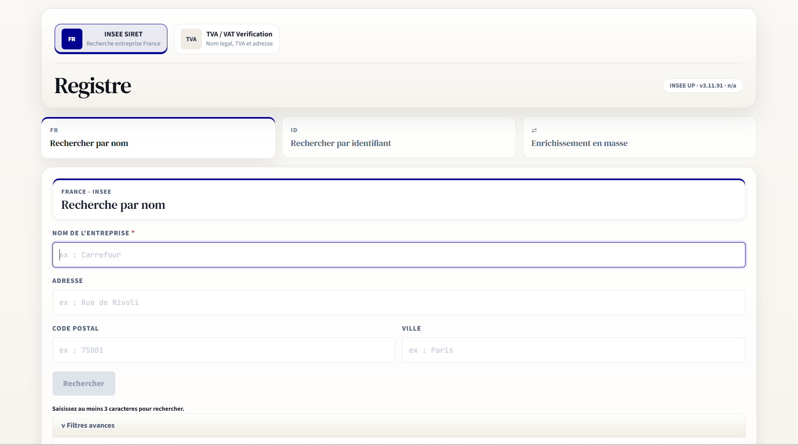
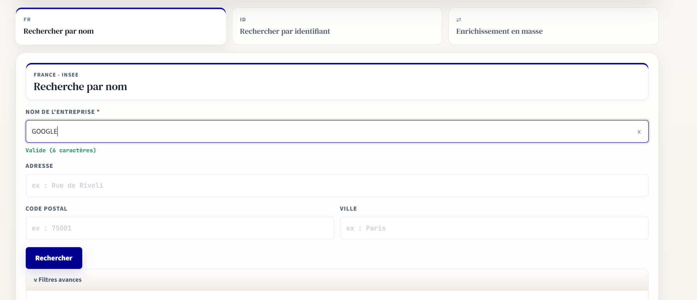
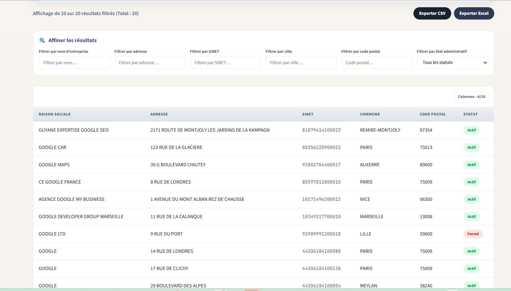
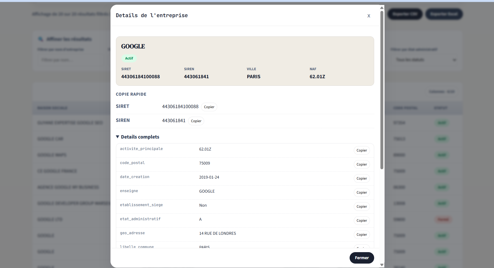
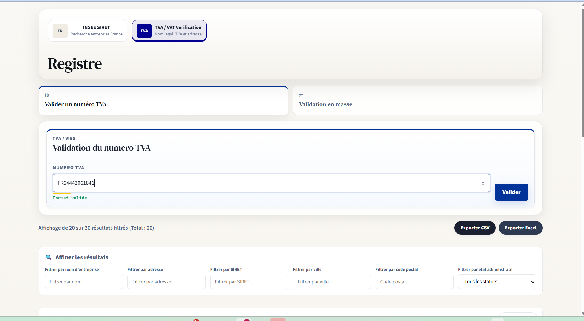

# Guide des captures d'ecran

Ce guide presente les principaux ecrans de l'application **FR SIRET / EU VAT**. Il sert de support rapide pour comprendre le parcours utilisateur: recherche INSEE, verification TVA/VIES, consultation des resultats, detail entreprise et import en lot.

## 1. Accueil INSEE et recherche par nom

Cet ecran montre l'entree principale cote INSEE. L'utilisateur choisit le service `INSEE SIRET`, puis utilise l'onglet `Rechercher par nom`.

Fonctionnalites visibles:

- Selection du service INSEE ou TVA/VAT.
- Statut de disponibilite du service INSEE.
- Navigation par intention: recherche par nom, recherche par identifiant, enrichissement en masse.
- Formulaire de recherche par nom avec adresse, code postal et ville.
- Message d'aide lorsque le bouton `Rechercher` est desactive.
- Acces aux filtres avances.

## 2. Recherche INSEE avec saisie valide

Cette capture illustre la validation de saisie sur une recherche par nom. Des que le nom contient assez de caracteres, le bouton devient utilisable.

Fonctionnalites visibles:

- Saisie du nom d'entreprise.
- Indication de validite de la saisie.
- Bouton de suppression du champ.
- Bouton `Rechercher` actif.
- Filtres avances accessibles sous le formulaire.

## 3. Resultats INSEE et filtres de tableau

Apres une recherche, l'application affiche une table de resultats INSEE. L'utilisateur peut filtrer, exporter ou ajuster les colonnes visibles.

Fonctionnalites visibles:

- Nombre de resultats affiches et total filtre.
- Export CSV et export Excel.
- Filtres de resultats par nom, adresse, SIRET, ville, code postal et statut administratif.
- Table avec raison sociale, adresse, SIRET, commune, code postal et statut.
- Badges de statut `Actif` / `Ferme`.
- Bouton de selection des colonnes visibles.

## 4. Detail d'une entreprise

Le clic sur une ligne ouvre une fenetre de detail. Elle met en avant les informations utiles avant d'afficher les champs complets.

Fonctionnalites visibles:

- Resume entreprise: nom, statut, SIRET, SIREN, ville et code NAF.
- Copie rapide du SIRET et du SIREN.
- Section `Details complets` avec les champs bruts aplatis.
- Boutons `Copier` pour reutiliser les valeurs.
- Fermeture de la modale.

## 5. Import en lot SIRET

Cet ecran montre le parcours d'enrichissement SIRET par fichier. L'utilisateur importe un fichier, choisit le traitement SIRET, puis selectionne la colonne contenant les SIRET.

Fonctionnalites visibles:

- Import CSV, TSV, XLSX ou XLSM.
- Selection laterale du traitement `SIRET INSEE`.
- Resume pre-execution: nombre de lignes, traitement choisi, colonne SIRET.
- Mapping de la colonne SIRET.
- Bouton unique `Lancer l'enrichissement`.
- Mention que le fichier est envoye au backend Python et que les appels externes restent cote serveur.

## 6. Import en lot TVA/VIES en cours

Cette capture montre le traitement TVA/VIES en mode import en lot. Le fichier est envoye au backend, qui effectue la verification et produit un classeur enrichi.

Fonctionnalites visibles:

- Selection laterale du traitement `TVA / VAT Verification`.
- Zone d'import fichier.
- Progression du traitement backend.
- Compteurs de lignes traitees.
- Indication que la frontiere d'execution est l'API cote serveur.
- Message indiquant que l'enrichissement peut prendre quelques secondes par ligne.

## 7. Verification directe TVA/VIES

Cet ecran montre la verification directe d'un numero TVA europeen.

Fonctionnalites visibles:

- Selection du service `TVA / VAT Verification`.
- Onglet `Valider un numero TVA`.
- Champ de saisie TVA avec validation de format.
- Bouton `Valider`.
- Resultats et filtres encore visibles en dessous lorsque des resultats precedents existent.

## Notes d'utilisation

- Les captures sont stockees dans le dossier `screenshots/`.
- Les donnees affichees sont des exemples de navigation et de rendu UI.
- Pour un guide public, eviter d'ajouter des captures contenant des secrets, des cles API, des donnees fournisseurs confidentielles ou des fichiers internes non anonymises.
