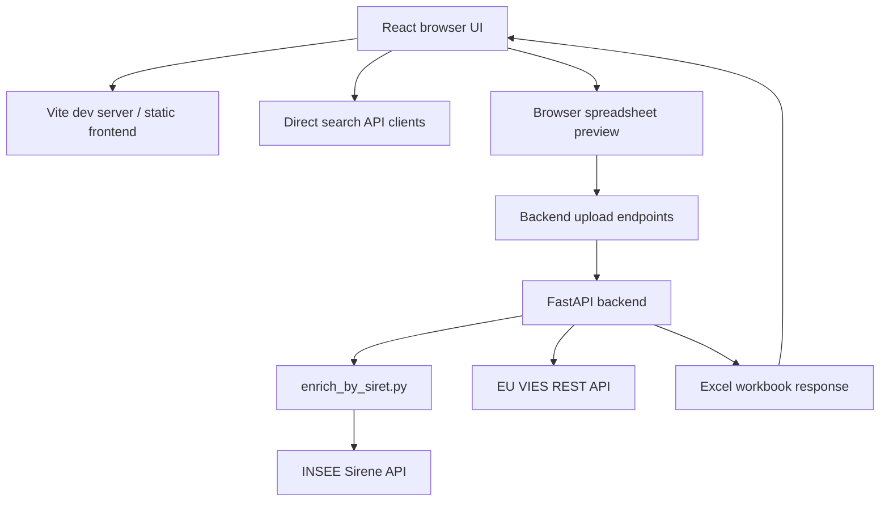
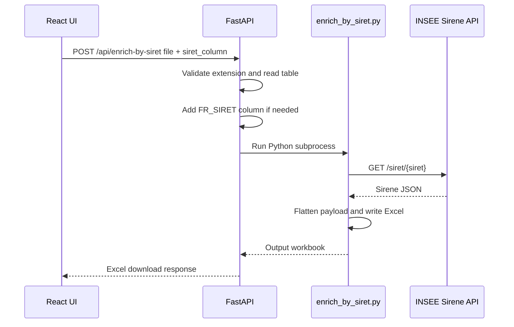
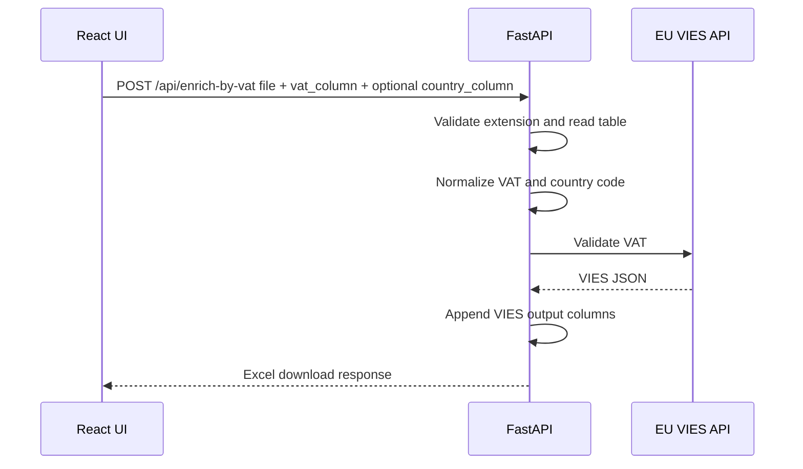
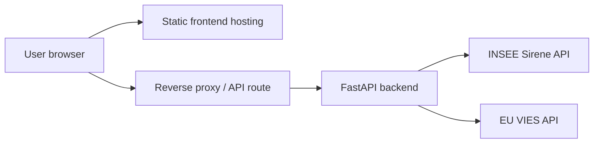

# FR SIRET / EU VAT - Product, Architecture, and Design Wiki

This wiki explains the app in detail: what it does, who it is for, how the main features work, how the code is organized, and why the current design choices were made.

## Contact

For questions, suggestions, collaboration, or support:

**Mouad Ibnelaryf** - [ibnelaryf.mouad@gmail.com](mailto:ibnelaryf.mouad@gmail.com)

## 1. Product Overview

**FR SIRET / EU VAT** is a web application for checking, validating, and enriching French company registry data and European VAT data.

The app supports two major business needs:

1. **Interactive lookup**: a user searches or verifies one company/VAT number at a time.
2. **Batch enrichment**: a user uploads a CSV or Excel file, selects the column containing SIRET or VAT values, runs server-side enrichment, and downloads an enriched Excel workbook.

The application focuses on supplier, customer, or business-entity verification workflows where users need reliable identity information before using company data in procurement, finance, compliance, onboarding, or master-data processes.

## 2. Functional Scope

The app currently covers two identifier families.

### France / INSEE

The INSEE side handles French company and establishment data:

- **SIRET**: 14-digit French establishment identifier.
- **SIREN**: 9-digit French legal-unit identifier.
- **Company name**: legal or commercial name used for search.
- **Address fields**: street address, postal code, city/commune.
- **Administrative status**: active or closed.
- **NAF/activity code**: business activity classification.
- **Sirene payload fields**: flattened INSEE data returned by the Sirene API.

### European Union / VIES

The VAT side handles EU VAT verification through VIES:

- VAT number normalization.
- Country-code detection.
- VIES validity.
- Legal name when returned by VIES.
- Registered address when returned by VIES.
- Request date and raw VIES payload fields.

## 3. Main User Journeys

### 3.1 Search French Companies By Name

The user selects **INSEE SIRET**, opens **Rechercher par nom**, and enters a company name.

The form supports:

- company name;
- address refinement;
- postal-code refinement;
- city refinement;
- advanced filters.

The search button is intentionally disabled until the company name has enough characters. A visible hint explains why the button is disabled, avoiding a silent disabled state.

Advanced filters include:

- SIRET refinement;
- NAF code;
- legal form;
- employee range;
- administrative status.

The result is a paginated/filterable table of INSEE establishments.

### 3.2 Search By SIRET Or SIREN

The user selects **Rechercher par identifiant** in the INSEE service.

The form validates:

- SIRET as exactly 14 digits;
- SIREN as exactly 9 digits.

When the input is valid, the user can run a direct lookup. This path is meant for precise checks when the identifier is already known.

### 3.3 Verify A VAT Number

The user selects **TVA / VAT Verification**, opens the VAT identifier view, and enters a VAT number such as `FR30334691813`.

The UI:

- normalizes the VAT value;
- validates the expected country-prefix format;
- enables the `Valider` button only when the format is valid;
- displays a direct VIES result card after validation.

The VAT result view is designed to show:

- valid/invalid status;
- legal name;
- VAT number;
- registered address;
- request metadata;
- reference fields from the VIES payload.

### 3.4 Review Results

Search results are displayed in a table with:

- visible business columns;
- active/closed status badges;
- table-level filters;
- CSV export;
- Excel export;
- a column picker.

The column picker shows how many columns are currently visible, for example `Colonnes - 6/19`.

Clicking a row opens a company-detail modal.

### 3.5 Inspect Company Details

The detail modal is split into two levels:

1. A summary card with the fields most users need:
   - company name;
   - status;
   - SIRET;
   - SIREN;
   - city;
   - NAF code.
2. A collapsible **Details complets** section with flattened raw fields.

The modal supports copy actions for SIRET, SIREN, and raw fields. Focus is trapped inside the modal while it is open, which improves keyboard accessibility.

### 3.6 Batch Enrichment By SIRET

The user opens **Import en lot**, selects **SIRET INSEE**, and uploads a CSV, TSV, XLSX, or XLSM file.

The browser parses a preview of the file so the user can select the SIRET column. The actual enrichment is sent to the Python backend.

The batch SIRET process:

1. user uploads the file;
2. browser detects likely SIRET columns;
3. user confirms the SIRET column;
4. frontend posts the file and selected column to `/api/enrich-by-siret`;
5. backend prepares a workbook with `FR_SIRET`;
6. backend runs `enrich_by_siret.py`;
7. `enrich_by_siret.py` calls INSEE Sirene `/siret/{siret}`;
8. backend returns an enriched Excel file.

The output workbook keeps the source columns and appends INSEE status/payload columns.

### 3.7 Batch Enrichment By VAT/VIES

The user opens **Import en lot**, selects **TVA / VAT Verification**, and uploads a CSV, TSV, XLSX, or XLSM file.

The user selects:

- the VAT column;
- optionally, a country-code column.

If no country-code column is selected, the backend tries to infer the country from the VAT prefix, for example `FR` in `FR12345678901`.

The backend posts each row to VIES and returns an enriched Excel workbook with appended columns such as:

- `VIES_Status`;
- `VIES_Is_Valid`;
- `VIES_Legal_Name`;
- `VIES_Registered_Address`;
- `VIES_VAT_Number`;
- `VIES_Request_Date`;
- `VIES_Raw_*`.

## 4. Architecture Overview

The app uses a **React frontend** and a **Python FastAPI backend**.



The key architectural decision is that **batch enrichment is backend-centered**. The browser can preview files and choose columns, but INSEE and VIES batch calls are handled server-side.

This avoids exposing sensitive credentials and avoids relying on browser-side CORS behavior for bulk external API calls.

## 5. Frontend Architecture

The frontend is a React 18 + Vite application.

### 5.1 Composition Root

`src/App.jsx` is the main composition root.

It wires:

- active service selection;
- active tab selection;
- search panels;
- batch workspace;
- result table;
- VAT result rendering;
- advanced filters;
- pagination;
- detail modal.

### 5.2 State Management

The app uses Zustand in `src/store/store.js`.

Important state areas include:

- active service: INSEE or VAT;
- active tab;
- search query fields;
- advanced filters;
- result list;
- pagination;
- loading and error state;
- selected company for the detail modal;
- service metadata.

State is kept centralized enough for cross-component coordination, while view-specific state remains local where practical.

### 5.3 Search Components

Search UI lives in `src/components/search`.

Important components:

- `TabNavigation.jsx`: lets the user choose search by name, search by identifier, or batch mode.
- `NameLocationSearchPanel.jsx`: name/address/postal-code/city search.
- `IdSearchPanel.jsx`: SIRET/SIREN/VAT direct validation inputs.

The current UI still presents a top-level service switcher for INSEE vs VAT. A future information-architecture redesign could move toward a unified **Search -> Verify -> Enrich** structure, but that is not the implemented structure today.

### 5.4 Filter Components

Filter UI lives in `src/components/filters`.

Important components:

- `AdvancedFilterPanel.jsx`: advanced INSEE filters, including SIRET refinement.
- `ActiveFiltersDisplay.jsx`: visible chips for active filters.

The advanced filter panel persists its expanded/collapsed state in `localStorage`, so first-time users see the filters, while returning users keep their preferred state.

### 5.5 Results Components

Result UI lives in `src/components/results`.

Important components:

- `ResultsTable.jsx`: interactive INSEE results table.
- `CompanyDetailModal.jsx`: summary plus raw-field detail.
- `VatValidationResult.jsx`: direct VIES result display.
- `ResultFilterBar.jsx`: table-level filtering.
- `ExportButton.jsx`: CSV/Excel export.
- `Pagination.jsx`: page navigation.
- `columnConfig.js`: column definitions and display logic.

### 5.6 Batch Components

Batch UI lives in `src/components/batch`.

Important components:

- `BatchWorkspace.jsx`: wraps the batch experience for the selected service.
- `BatchEnrichment.jsx`: shared SIRET/VAT batch upload flow.

The shared batch component is intentionally used for both SIRET and VAT so the user gets the same workflow:

1. choose treatment;
2. upload file;
3. choose column;
4. review pre-flight summary;
5. launch enrichment;
6. download workbook.

## 6. Frontend Services And API Clients

### 6.1 Direct INSEE Client

`src/api/inseeApiClient.js` handles direct INSEE lookup and search.

It depends on:

- `queryBuilder.js` for Sirene query URLs;
- `cache.js` for short-lived caching;
- `requestQueue.js` for controlled request flow;
- `serviceInfoClient.js` for service metadata.

### 6.2 Direct VIES Client

`src/api/viesApiClient.js` handles direct VAT verification.

It normalizes VIES responses into the app's result model so the UI can display a consistent result card.

### 6.3 Batch Frontend Facade

`src/services/batchEnrichmentService.js` is a thin facade.

It re-exports:

- spreadsheet parsing from `batch/csvHandler.js`;
- SIRET detection/upload from `batch/siretEnrichmentService.js`;
- VAT/country detection/upload from `batch/viesEnrichmentService.js`.

This facade keeps the UI import stable and avoids making `BatchEnrichment.jsx` know every internal service file.

## 7. Backend Architecture

The backend is a FastAPI application in `backend/app.py`.

It exposes:

- `GET /api/health`;
- `POST /api/enrich-by-siret`;
- `POST /api/enrich-by-vat`.

The backend owns:

- uploaded file validation;
- supported file extension checks;
- CSV/TSV/Excel reading;
- SIRET workbook preparation;
- calling the SIRET enrichment subprocess;
- VIES row-by-row enrichment;
- Excel output generation;
- cleanup of temporary files.

### 7.1 SIRET Backend Flow



### 7.2 VAT Backend Flow



### 7.3 Why Python For Batch Enrichment

Python is used for batch enrichment because:

- pandas and openpyxl are strong fits for spreadsheet processing;
- the existing SIRET engine already handles INSEE authentication, throttling, flattening, and workbook formatting;
- backend execution protects credentials from browser exposure;
- long-running work is easier to control server-side than in the browser.

## 8. Authentication And Configuration

### 8.1 INSEE Credentials

SIRET enrichment requires one or more INSEE Sirene API keys.

Keys can be obtained for free from the official INSEE API catalogue:

[https://api.insee.fr/catalogue/](https://api.insee.fr/catalogue/)

Supported modes:

- `INSEE_TOKEN`: OAuth bearer token.
- `VITE_INSEE_API_KEY`, `VITE_INSEE_API_KEY2`, etc.: integration keys used by the Python backend key rotator.

The `VITE_` prefix is historical. For enrichment, these values are read by Python and should be treated as backend secrets.

### 8.2 Backend Runtime Variables

Important environment variables:

| Variable | Purpose |
| --- | --- |
| `INSEE_TOKEN` | Bearer token for INSEE Sirene. |
| `VITE_INSEE_API_KEY*` | Integration keys for INSEE key rotation. |
| `INSEE_MAX_WORKERS` | Worker count for SIRET enrichment. |
| `SIRET_ENRICH_TIMEOUT_SEC` | Subprocess timeout for SIRET enrichment. |
| `INSEE_MIN_INTERVAL_SEC` | Minimum interval between INSEE calls. |
| `INSEE_GLOBAL_CALLS_PER_MINUTE` | Global INSEE rate limit. |
| `VIES_TIMEOUT_SEC` | Timeout for VIES calls. |

## 9. Data Contracts

### 9.1 Supported Input Files

The batch UI and backend support:

- `.csv`;
- `.tsv`;
- `.xlsx`;
- `.xlsm`.

CSV delimiter detection supports common delimiters such as comma, semicolon, tab, and pipe.

### 9.2 SIRET Batch Input Contract

The user must identify one column that contains SIRET values.

The backend prepares the file for `enrich_by_siret.py` by ensuring a `FR_SIRET` column exists.

If the user-selected column is already `FR_SIRET`, it is reused. Otherwise, the backend copies the selected column into `FR_SIRET`.

### 9.3 VAT Batch Input Contract

The user must identify one VAT column.

A country column is optional:

- if selected, the backend uses it as the country code;
- if absent, the backend attempts to infer the country code from the VAT prefix.

### 9.4 Output Contracts

SIRET output:

- original columns;
- `INSEE_STATUS`;
- flattened INSEE fields from the Sirene response.

VAT output:

- original columns;
- `VIES_Source_VAT`;
- `VIES_Source_Country_Code`;
- `VIES_Normalized_VAT`;
- `VIES_Status`;
- `VIES_Is_Valid`;
- `VIES_User_Error`;
- `VIES_Legal_Name`;
- `VIES_Registered_Address`;
- `VIES_VAT_Number`;
- `VIES_Request_Date`;
- `VIES_Raw_*` fields.

## 10. Error Handling Model

The app uses explicit error boundaries at external-system edges:

- browser file parsing;
- backend upload;
- backend file validation;
- subprocess execution;
- INSEE calls;
- VIES calls;
- Excel generation.

User-facing errors are intended to explain the action needed, for example selecting a missing column or uploading a supported file type.

Backend subprocess and network calls use timeouts to avoid hanging forever.

## 11. Accessibility And UI Design

The UI follows practical accessibility principles:

- semantic form labels;
- visible validation messages;
- disabled-button hints;
- keyboard-usable rows and buttons;
- focus trap in modals;
- visible status text, not color alone;
- explicit labels for batch mapping selects;
- predictable tab and section structure.

The visual design is intentionally restrained:

- clear service selection;
- task cards for major workflows;
- side selector for batch treatment;
- dense but readable result table;
- summary-first modal for company details;
- consistent spacing and typography.

The app borrows clarity principles from French/EU public-service interfaces without copying official DSFR or EU institutional branding.

## 12. Design System Notes

Core styling is split across:

- `src/tokens.css`: shared design tokens;
- `src/App.css`: app shell and service switcher;
- component-level CSS files for search, filters, results, and batch.

Important UI patterns:

- **Service switcher**: toggles INSEE vs VAT.
- **Tab navigation**: changes task context.
- **Advanced filters**: persistent expanded/collapsed panel.
- **Result table**: sortable, filterable, exportable.
- **Modal detail**: summary first, raw details second.
- **Batch side selector**: lets the user choose SIRET or VAT treatment without hiding the choice in a dropdown.

## 13. Testing And Quality

The project includes automated tests for:

- validation helpers;
- API clients;
- query builder logic;
- request queue/dedup/cache behavior;
- hooks;
- UI components;
- batch parsing and enrichment services;
- legacy identity/scoring pipeline pieces.

Main commands:

```powershell
npm run lint
npm test -- --run
npm run build
python -m py_compile backend/app.py enrich_by_siret.py insee_key_rotator.py
```

Dead-code/dependency surface check:

```powershell
npx knip --no-exit-code --reporter compact
```

## 14. Deployment Model

The recommended production shape has two deployable parts:

1. Static React frontend from `dist/`.
2. FastAPI backend serving `/api/*`.



Expected routing:

| Route | Target |
| --- | --- |
| `/` | React app from `dist/index.html`. |
| `/assets/*` | Vite static assets. |
| `/api/enrich-by-siret` | FastAPI backend. |
| `/api/enrich-by-vat` | FastAPI backend. |
| `/api/health` | FastAPI backend. |

## 15. Security Considerations

Important security rules:

- never commit `.env`;
- keep INSEE credentials server-side;
- do not expose real API keys in screenshots or README examples;
- use HTTPS in production;
- set upload size limits at the hosting/proxy layer;
- restrict access if the app is internal-only;
- avoid logging secrets or sensitive supplier data;
- sanitize public screenshots.

The repo `.gitignore` excludes local secrets, build output, node modules, cache folders, temporary files, and local spreadsheet data.

## 16. Legacy And Future Work

The current simplified batch workflow uses:

- `BatchEnrichment.jsx`;
- `batchEnrichmentService.js`;
- `siretEnrichmentService.js`;
- `viesEnrichmentService.js`;
- `backend/app.py`;
- `enrich_by_siret.py`.

Some older multi-step enrichment pipeline files still exist under `src/services/batch`, `src/domain`, and related service folders. They are covered by tests but are not the main simplified batch path. They should be reviewed in a separate removal/refactor pass before deletion.

Potential future improvements:

- true unified information architecture: `Search -> Verify -> Enrich`;
- async job queue for large files;
- streaming progress updates;
- server-side persisted job history;
- authenticated internal deployment;
- code-splitting for the large ExcelJS frontend chunk;
- mobile card mode for dense result tables;
- a dedicated GitHub Wiki generated from this file.

## 17. Screenshot Guide

The visual walkthrough is available in:

[SCREENSHOTS_GUIDE.md](./SCREENSHOTS_GUIDE.md)

It documents the main screens with embedded images and short explanations.

## 18. Contact

For questions or discussion:

[ibnelaryf.mouad@gmail.com](mailto:ibnelaryf.mouad@gmail.com)
